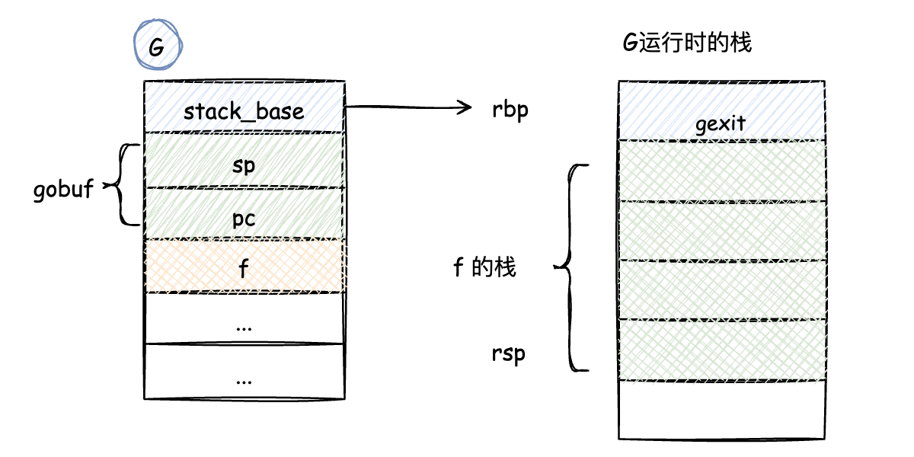
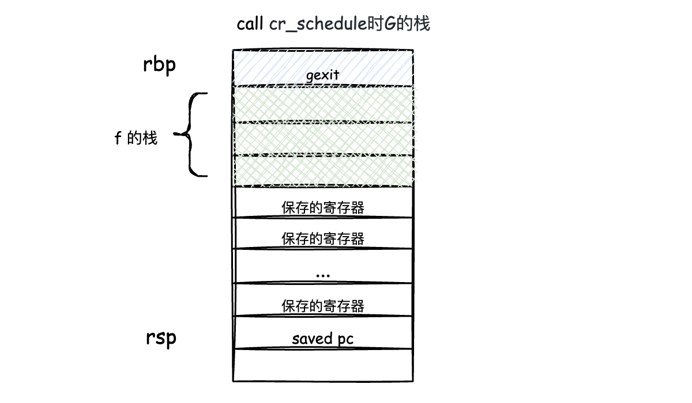
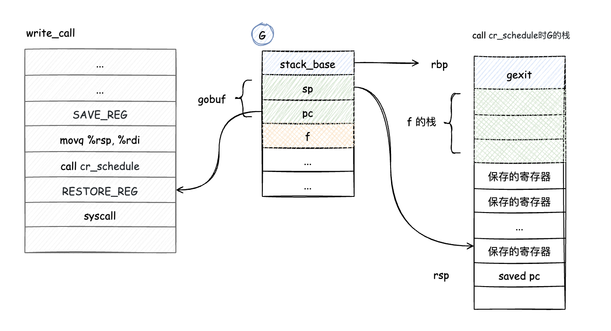
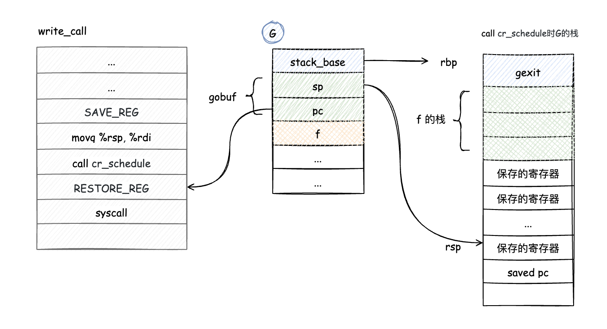
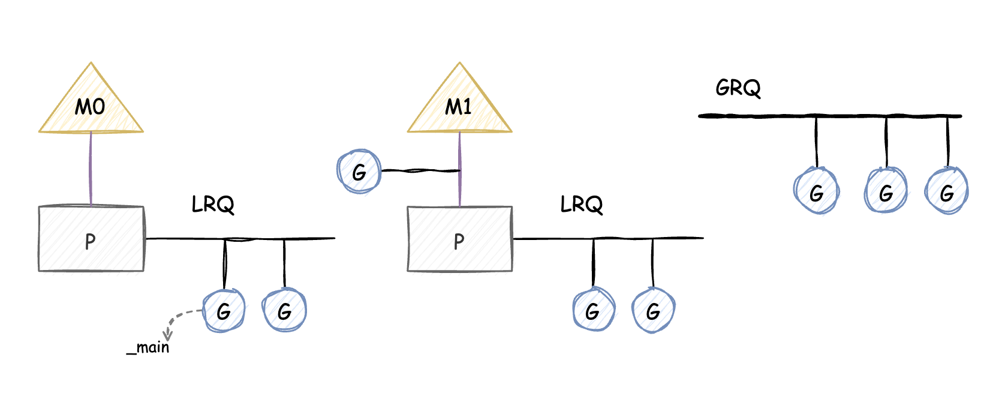

# GMP Draft

## 关于本文

本文只是简单模拟了Golang中GMP的基本调度方案，并不是真正Golang的实现原理。demo只在Ubuntu(20.04, intel x64平台)物理机，和Ubuntu镜像(tag:20.04，mac物理机)下测试通过。demo并不是一气呵成实现了gmp的调度方案，而是循序渐进的方式，每次迭代都在不同的分支。

## 关于Golang GMP

虽然demo是关于GMP的是实现，但这里并不打算详细讲解GMP的调度原理（详细的关于GMP介绍的文章最后会给出链接），现在只是简单解释一下GMP的概念。
G:代表的是Coroutine，可执行的Go程序。M: 代表的是OS Thread。P:代表的是Logical Processor也可以理解成Context。


## feat/demo-0.0.1

第一个最简单的版本代码在分支`feat/demo-0.0.1` 。这个版本总体来说其实是一个`生产者-消费者`模型。    
G: 就是一个可执行的`func`。    
P: 只维护了一个LRQ(Local Run Queue)队列，G 会 enqueue/dequeue。   
M: 相当于一个工作线程，与P绑定。   
Sched： 维护了一个GRQ(Global Run Queue)。   
生产者: 主线程M生产G，并放入GRQ队列中。   
消费者: 消费线程M从LRQ获取G，若LRQ没有，则从GRQ中获取G并放入LRQ中，最终还是从LRQ中获取G，并执行，若没有G，则阻塞。


可通过下面的命令进行编译执行
> gcc -pthread hello.c -o hello   
>  ./hello

这个版本的G还是运行在线程M的栈空间，并不是自己的栈空间上。下个版本实现让G运行在自己的栈空间。   
请切到分支`feat/demo-0.0.2`

## feat/demo-0.0.2

这个版本只修改了一点逻辑。将执行G的函数执行方式 `g->f()`，换成了`cr_call`。然后给每个G分配了一块内存区域。

```c
// feat/demo-0.0.1
int clone_start(M* mm)
{
	P* p = mm->p;

	while (1) {
		G* g = get_g(p);
		g->f();
	}

	return 0;
}

//  feat/demo-0.0.2
void* schedule()
{
	G* g = get_g(m->p);

	cr_call(&g->gobuf, g->f);

	return NULL;
}
```

想要G运行在自己的栈空间，得给G分配一块内存区域供G作为栈来使用，并用`stack_base`指针指向分配空间的高地址（栈底是高地址，栈顶是低地址）。在执行G的函数时，我们将寄存器`SP`（栈顶指针）,`BP`（栈底指针）设置成`stack_base`的值，这样G的函数执行时，就运行在了自己的栈空间上，栈底是`stack_base`。汇编函数`cr_call(Gobuf*, Fn)`实现了这个的功能。


```c
cr_call:

movq (%rdi), %rax
movq %rax, %rsp
movq %rsp, %rbp

// push buf.pc
movq 8(%rdi), %rax
pushq %rax

movq %rsi, %rax
// call f
jmp *%rax

ret
```

根据C语言函数调用规约，前6个参数依次通过寄存器传递`rdi`,`rsi`,`rdx`,`rcx`,`r8`,`r9`（x64 平台）。因此参数`Gobuf*`的值在`rdi`寄存器，`Fn`的值在`rsi`寄存器。

1. 将`rsp`, `rbp`设置成`stack_base`的值。
2. 将`Gobuf.pc`的值压栈，即将`gexit`函数地址压栈。
3. 执行函数`Fn`。即`jmp`到函数`Fn`的地址。`jmp`会修改`pc`的值。


对第2项进行解释。将`gexit`函数地址压栈，是待函数`Fn`执行完成后，然后再执行`gexit`。因为函数`Fn`的最后一条指令一定是`ret`，它的作用相当于是出栈，执行。因此在`Fn`执行完后，会弹出`gexit`，然后执行`gexit`，进行调度，执行下一个G，这样就到达了`feat/demo-0.0.1`分支里面的`while(1)`的功能。




这个版本只是在函数`Fn`执行完成后进行调度。并不是像Golang的协作式调度，进入系统调用时调度。下个版本实现*协作式调度*（🤣）。

请切到分支`feat/demo-0.0.3`


## feat/demo-0.0.3

这个版本将在进入系统调用时进行调度。当然并不是所有的系统调用都进行调度，只是hook了`printf`函数，修改为`write_call`，只在执行`write_call`函数时才会进行调度。

总体改动也不大，增加了3个汇编函数`write_call`, `cr_schedule`, `cr_switch`。

- `write_call` 是调用系统函数`write`将内容打印在`stdout`，在调用之前进行*协作式调度*（保存上下文，执行下一个G)。
- `cr_schedule` 保存当前G的`Gobuf`，即`sp`,`pc`。然后再执行`schedule`调度，寻找下一个可执行G，执行。
- `cr_switch` 重新执行之前被调度的G，恢复G执行的上下文。

在调用`cr_schedule`时，栈布局如图



`call`指令首先会将下一段要执行的指令地址`push`到栈中。即`rsp`寄存器所指向的内存的值是`pc`将要执行的地址（`call cr_schedule`，`cr_schedule`函数执行完成后，就执行`pc`地址指令，和`gexit`被执行的逻辑一样，`cr_schedule`执行`ret`后，`saved pc`被弹栈，执行）。

```c
cr_schedule:

    // 当前正在执行的G的地址 -> rax
	movq %fs:g@tpoff, %rax
    // &g.gobuf -> rax
	leaq 8(%rax), %rax

    // sp作为参数传递，sp -> gobuf.sp
	movq %rdi, (%rax)
	movq (%rsp), %rdx
    // saved pc -> pc
	movq %rdx, 8(%rax)

	call schedule
ret
```


执行完`cr_schedule`后，栈布局如图



此时`gobuf.pc`保存了下一段要执行的指令`RESTORE_REG`（不要在意宏展开）。`gobuf.sp`指向的是`保存的寄存器`的栈顶。上下文都已经压栈。此时，可以放心的切换到其他的G去执行了。

如何恢复G的执行呢？`cr_switch`

我们将G调度的时候，G执行到了函数`write_call`的`call cr_schedule`这段指令，后面即将执行`RESTORE_REG`。因此在恢复G执行的时候，我们需要让G继续执行`RESTORE_REG`。

```c
// cr_switch(Gobuf *buf)
cr_switch:

    // gobuf.sp -> rsp
	movq (%rdi), %rsp
    // gobuf.pc -> rax
	movq 8(%rdi), %rax

    // 执行pc处的指令
	jmp *%rax
ret
```
在执行`cr_switch`之前，栈的布局如上图。在执行到`movq 8(%rdi), %rax`指令后，布局如下图



`rsp`的值正好是了`保存的寄存器`的顶端，然后`jmp *%rax`执行`RESTORE_REG`将寄存器的值都出栈。恢复了G的上下文，继续执行。

以上虽然完成了G运行在自己的栈空间和协作式调度，但依旧是基于`生产者-消费者`模型。主线程只能把G `enqueue` 到`GRQ`中，并不能作为一个工作线程来调度。下一个版本将主线程实现成M0，让M0可作为工作线程。

请切到分支`feat/demo-0.0.4`


## feat/demo-0.0.4

因为程序启动的入口是`main`函数，但是程序必须在`main`函数执行前初始化好`sched`，这样能保证`main`在创建新的G时能`enqueue`到`LRQ`中。因此我们得将`main`移到汇编中，重新定义程序的入口`_main`，保证`_main`执行时`sched`已经初始化完成。此时`_main`可看做成程序执行的入口，它其实就是一个普通的函数，和`print_a`没有是区别。

M0 初始化完成后，执行的第一个G，其实就是`_main`。在`_main`中通过`CR`创建的 G 都`enqueue`到 `LRQ`中。这样主线程M0就可以当做工作线程跑起来了。



在`feat/demo-0.0.2`分支里讲到，在`Fn`执行完成后，会调用`gexit`进行调度，如果没有可运行的G那么线程会阻塞。此时会阻塞在`G`的栈上面，导致G不能被回收。因此，在这个场景下（还有其他场景）需要切换到其他栈上面运行，即：g0。


请切到分支`feat/demo-0.0.5`


## feat/demo-0.0.5

这个版本新增加了`g0_call(Fn)`函数，就是在g0栈上执行函数`Fn`。因此，`gexit`就得被换成`go_call(gexit)`，即`g0exit`。还有在`schedule`的地方也得改成`g0_call(schedule)`。

看看`g0_call`的具体实现

```c
// g0_call(Fn f), call f on g0's stack
// f in rdi
g0_call:

	movq %fs:g@tpoff, %rax
	leaq 8(%rax), %rax

	leaq 8(%rsp), %rdx
	movq %rdx, (%rax)
	movq (%rsp), %rdx
	movq %rdx, 8(%rax)

	//	switch to g0
	movq %fs:m@tpoff, %rax
	movq (%rax), %rax

	movq (%rax), %rbp
	movq (%rax), %rsp
	call *%rdi
ret
```

前面一部分和`cr_schedule`逻辑一样，保存当前运行G的上下文。后面一部分就是切换到g0栈上执行。如果你把g0当做一个普通的G来看待，就其实从一个G切换到另外一个G的过程，没有什么特殊的地方，只是这个g0没有可执行的代码。

g0栈其实就是OS Thread的栈。在`pthread_create`创建线程的时候，申请了g0栈作为线程栈。

至此，GMP模型有了一个初步的轮廓。但是还有一些功能没有实现，比如 P 的`handoff`, `netpoller`等。

请切到分支 ...🤣

**TBD...** 


### Ref

- 图片用 [draw.io](https://app.diagrams.net/) 绘制
- https://qcrao91.gitbook.io/go/goroutine-tiao-du-qi
- https://draveness.me/golang/docs/part3-runtime/ch06-concurrency/golang-goroutine/
- https://morsmachine.dk/go-scheduler
- https://morsmachine.dk/netpoller
- https://www.ardanlabs.com/blog/2018/08/scheduling-in-go-part1.html
- https://www.ardanlabs.com/blog/2018/08/scheduling-in-go-part2.html
- https://www.ardanlabs.com/blog/2018/12/scheduling-in-go-part3.html
- 《深入理解计算机系统》第3版
- 《操作系统真象还原》郑钢著