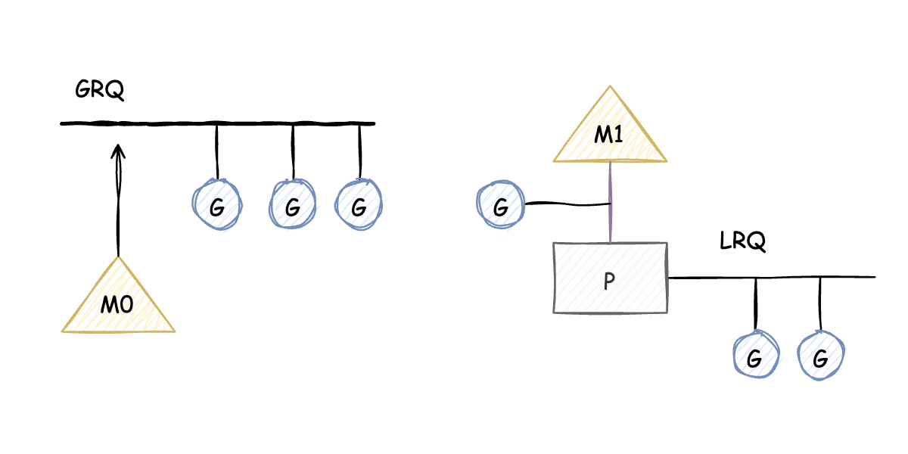

# GMP Draft

## 关于本文

本文只是简单模拟了Golang中GMP的基本调度方案，并不是真正Golang的实现原理。demo只在Ubuntu(20.04,intel平台)物理机，和Ubuntu镜像(tag:20.04，mac物理机)下测试通过。demo并不是一气呵成实现了gmp的调度方案，而是循序渐进的方式，每次迭代都在不同的分支。

## 关于Golang GMP

虽然demo是关于GMP的是实现，但这里并不打算详细讲解GMP的调度原理（详细的关于GMP介绍的文章最后会给出链接），现在只是简单解释一下GMP的概念。
G:代表的是Coroutine，可执行的Go程序。M: 代表的是OS Thread。P:代表的是Logical Processor也可以理解成Context。

## feat/demo-0.0.1

第一个最简单的版本代码在分支`feat/demo-0.0.1` 。这个版本总体来说其实是一个`生产者-消费者`模型。    
G: 就是一个可执行的`func`。    
P: 只维护了一个LRQ(Local Run Queue)队列，G 会 enqueue/dequeue。   
M: 相当于一个工作线程，与P绑定。   
Sched： 维护了一个GRQ(Global Run Queue)。   
生产者: 主线程M生产G，并放入GRQ队列中。   
消费者: 消费线程M从LRQ获取G，若LRQ没有，则从GRQ中获取G并放入LRG中，最终还是从LRQ中获取G，并执行，若没有G，则阻塞。

可通过下面的命令进行编译执行
> gcc -pthread hello.c -o hello   
>  ./hello

这个版本的G还是运行在线程M的栈空间，并不是自己的栈空间上。下个版本实现让G运行在自己的栈空间。   
请切到分支`feat/demo-0.0.2`

### Ref

- 图片用 [draw.io](https://app.diagrams.net/) 绘制
- https://qcrao91.gitbook.io/go/goroutine-tiao-du-qi
- https://draveness.me/golang/docs/part3-runtime/ch06-concurrency/golang-goroutine/
- https://morsmachine.dk/go-scheduler
- https://morsmachine.dk/netpoller
- https://www.ardanlabs.com/blog/2018/08/scheduling-in-go-part1.html
- https://www.ardanlabs.com/blog/2018/08/scheduling-in-go-part2.html
- https://www.ardanlabs.com/blog/2018/12/scheduling-in-go-part3.html
